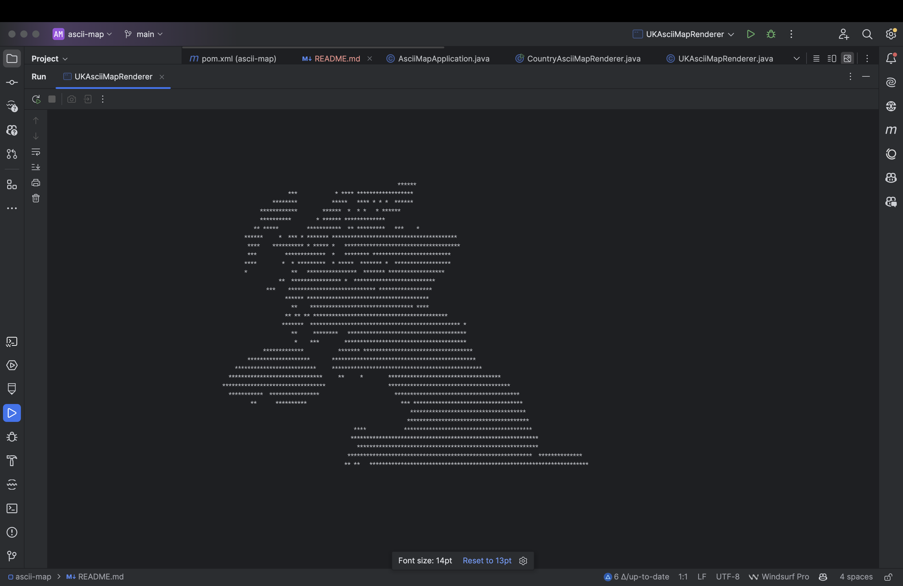

# ASCII Map Generator

A Spring Boot application that renders ASCII art maps from geographic coordinate data. The application provides two distinct rendering features:

1. `UKAsciiMapRenderer` - A console-based UK map renderer
2. `CountryAsciiMapRenderer` - A web-based application with React UI for rendering maps of any country

## Table of Contents

- [UK ASCII Map Renderer](#uk-ascii-map-renderer)
- [Country ASCII Map Renderer](#country-ascii-map-renderer)
- [Technical Details](#technical-details)
- [Sample Outputs](#sample-outputs)

## UK ASCII Map Renderer

### Core Functionality

The `UKAsciiMapRenderer` reads UK latitude/longitude coordinates from `ukpostcodes.csv` and renders them as an ASCII representation of the UK map in the console. This feature:

- Parses CSV data containing UK postal codes with their geographic coordinates
- Maps these coordinates to a 2D grid, scaling them to fit the desired console dimensions
- Renders the map using ASCII characters (e.g., '*') to represent coordinates

### Quick Start Guide for UKAsciiMapRenderer

Follow these steps to run the UKAsciiMapRenderer locally:

1. Clone the repository:
   ```bash
   git clone https://github.com/daimn55/ascii-map.git
   cd ascii-map
   ```

2. Unzip the UK data file into the resources directory:
   ```bash
   unzip src/main/resources/ukpostcodes.csv.zip -d src/main/resources/
   ```

3. Build the application:
   ```bash
   mvn clean install
   ```

4. Run the UKAsciiMapRenderer directly:
   ```bash
   java -cp target/ascii-map.jar com.art.ascii.UKAsciiMapRenderer
   ```

**Requirements:**
- Java 17 or higher
- Maven 3.6 or higher

### Running via REST API

You can also access the UK ASCII Map through a REST API by running the Spring Boot application:

1. Start the Spring Boot application:
   ```bash
   mvn spring-boot:run
   ```

2. Access the UK map via:
   ```bash
   # Using curl
   curl http://localhost:8080/api/uk-map

   # Or open in browser
   http://localhost:8080/api/uk-map
   ```

### Key Assumptions

- The CSV file (`ukpostcodes.csv`) contains valid UK coordinate data and enough coordinates to render a meaningful map.
- CSV format: Contains at least latitude and longitude columns
- Coordinates are within UK bounds (approximately latitude 49°N-61°N, longitude 8°W-2°E)
- Console has sufficient width and height to display the map effectively

## Country ASCII Map Renderer

### Core Functionality

The `CountryAsciiMapRenderer` is a web application that allows users to generate ASCII maps of any country using data from `geonames-postal-code.csv`. The feature:

- Presents a user-friendly web interface built with React
- Allows users to select countries from a dropdown or enter custom country codes
- Renders map data via an API endpoint and displays it on the webpage
- Provides options to customize map dimensions
- Allows maps to be downloaded as text files

### Quick Start Guide for CountryAsciiMapRenderer

Follow these steps to run the CountryAsciiMapRenderer locally:

1. Clone the repository:
   ```bash
   git clone https://github.com/daimn55/ascii-map.git
   cd ascii-map
   ```

2. Unzip the global data file into the resources directory:
   ```bash
   unzip src/main/resources/geonames-postal-code.csv.zip -d src/main/resources/
   ```

3. Build and run the Spring Boot application:
   ```bash
   mvn clean install
   mvn spring-boot:run
   ```

4. Access the web UI:
   ```
   http://localhost:8080
   ```

5. API Access (for direct calls):
   ```bash
   curl http://localhost:8080/api/render-map/US?width=120&height=60
   ```

**Requirements:**
- Java 17 or higher
- Maven 3.6 or higher
- Spring Boot 3.0 or higher

### Online Demo

The application is hosted on AWS EC2 and can be accessed at:
```
http://ec2-13-235-80-164.ap-south-1.compute.amazonaws.com:8443
```

### User Interface Features

- Country selection dropdown with popular countries list
- Custom country code input option
- Width and height customization
- Console theme toggle
- Download button for saving maps as text files
- Responsive design for various screen sizes

### Key Assumptions

- The CSV file (`geonames-postal-code.csv`) contains valid global coordinate data
- CSV format: First column contains country code, with coordinates in subsequent columns
- Coordinate data is available for the requested countries to render meaningful maps
- Reasonable map dimensions (width 10-200, height 10-100)

### Code Design and Best Practices

- **Separation of Concerns**:
  - Backend: Java Spring Boot for data processing and API endpoints
  - Frontend: React components for UI rendering
  - Data: Separate coordinate cache for efficient retrieval

- **Responsive UI**:
  - Responsive layout
  - Progressive loading with loading indicators
  - Error messaging

### Optimization Techniques

- **Coordinate Caching**: Pre-loads country codes and lazily loads coordinates(can be controlled via configuration)
- **Batch Processing**: Processes large CSV files in batches
- **Concurrent Processing**: Uses CompletableFuture for parallel data processing
- **Data Filtering**: Only processes relevant country data

## Technical Details

### Application Architecture

```
ascii-map/
├── src/
│   ├── main/
│   │   ├── java/
│   │   │   └── com/art/ascii/
│   │   │       ├── AsciiMapApplication.java        # Main Spring Boot application
│   │   │       ├── UKAsciiMapRenderer.java         # UK map renderer implementation
│   │   │       ├── CountryAsciiMapRenderer.java    # Country map renderer implementation
│   │   │       ├── cache/
│   │   │       │   └── CoordinateCache.java        # Caching for coordinates
│   │   │       └── controller/
│   │   │           ├── UKAsciiMapController.java   # UK map API endpoint
│   │   │           └── CountryAsciiMapController.java # Country map API endpoint
│   │   ├── resources/
│   │   │   ├── application.properties              # Application configuration
│   │   │   ├── ukpostcodes.csv.zip                 # UK coordinate data (zipped)
│   │   │   ├── geonames-postal-code.csv.zip        # Global coordinate data (zipped)
│   │   │   └── static/                             # Web application static files
│   │   │       ├── index.html                      # Web application entry point
│   │   │       ├── app.js                          # React application
│   │   │       └── styles.css                      # Application styles
│   └── test/                                       # Unit and integration tests
├── images/                                         # Screenshots and example outputs
├── pom.xml                                         # Maven configuration
```

### Dependencies

- Java 17 or higher
- Spring Boot 3.x
- Maven 3.6 or higher
- React (served as static content)
- OpenCSV for CSV parsing
- Bootstrap for UI styling

### Configuration

Key application properties (in `application.properties`):

```properties
# Server configuration
server.port=8080

# CSV file paths
ascii.map.uk-csv-file-path=ukpostcodes.csv
ascii.map.csv-file-path=geonames-postal-code.csv

# Coordinate loading configuration
ascii.map.preload-coordinates=false
ascii.map.batch-size=1000

# Default map dimensions
ascii.map.default-width=120
ascii.map.default-height=60
```

### Performance Considerations

- For large countries with many coordinates, map generation may take a few seconds
- The application uses a coordinate cache to improve subsequent rendering of the same country
- Application can load the co-ordinates at boot time or lazily load them based on configuration
- Batch size can be adjusted in configuration for optimal performance based on available memory

## Sample Outputs

### UKAsciiMapRenderer Console Output

When running the UKAsciiMapRenderer directly from its main method, you'll see an ASCII map of the UK in your console:



The console output shows the geographical shape of the United Kingdom using asterisks (*) to represent postal code coordinates. This representation clearly outlines the distinctive shape of Great Britain and Northern Ireland.

### CountryAsciiMapRenderer Web Interface

The web-based CountryAsciiMapRenderer provides an interactive interface for generating ASCII maps of any country:


The web interface features:

1. **Input Form at the top:**
   - Country selection dropdown with popular countries list
   - Custom country code checkbox option
   - Width and height input fields
   - Console theme toggle switch
   - Generate Map button

2. **Map Display area:**
   - Shows the country name and code as a heading
   - Displays the map with green dots on a black background (when console theme is enabled)
   - Provides "Generate Another" and "Download Map" buttons for additional actions

The screenshot shows the United Kingdom (GB) rendered as an ASCII map with clear outlines of Scotland, England, Wales, and Northern Ireland. Each dot represents a postal code location, with the density of dots indicating population density.
